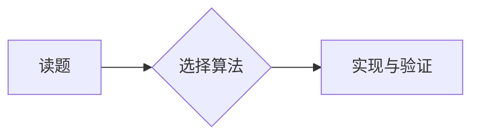

# Zinc Acetate 的算法竞赛博客

部署地址：<https://zinc-acetate.github.io/>

博客使用 [Eleventy](https://www.11ty.dev/) 生成。文章写成 Markdown，首页、归档、搜索索引、RSS 和站点地图会在构建时自动更新。

项目列表位于 `/projects/`，由 GitHub Actions 每天构建时自动读取公开仓库。首页只保留项目页面入口。

## 本地预览

```powershell
npm install
npm run dev
```

打开命令行显示的本地地址。修改文件后，页面会自动重新构建。

## 发布新文章

在 `src/posts/` 新建 Markdown 文件：

```markdown
---
title: 文章标题
description: 一句话摘要
date: 2026-07-19
category: 题解
readingTime: 6 min
tags:
  - posts
  - 题解
---

从这里开始写正文。
```

文件名建议使用 `年-月-日-英文短标题.md`。完成后提交并推送：

```powershell
git add .
git commit -m "Add a new post"
git push
```

GitHub Actions 会自动构建并发布。

### 数学公式

行内公式使用 `$...$`，块级公式使用 `$$...$$`：

```markdown
行内公式 $O(n \log n)$。

$$
\sum_{i=1}^{n} i = \frac{n(n+1)}{2}
$$
```

### HTML、代码、表格与 Mermaid

正文支持常用的安全 HTML，例如 `details`、`summary`、`mark`、`kbd`、`figure` 和 `img`。出于安全考虑，`script`、`iframe`、表单、事件属性和危险链接等内容会被自动移除。

代码块在开头的三个反引号后标注语言即可启用高亮和复制按钮，例如 `cpp`、`python`、`java`、`javascript`、`typescript`、`rust`、`go`、`sql`、`bash`、`json`、`yaml`、`html` 和 `css`：

````markdown
```cpp
#include <iostream>

int main() {
    std::cout << "Hello" << '\n';
}
```
````

表格使用标准 Markdown 管道语法：

```markdown
| 算法 | 复杂度 |
| --- | ---: |
| Dijkstra | $O((n+m)\log n)$ |
```

Mermaid 图表使用 `mermaid` 代码围栏：

````markdown

````

Mermaid 以严格安全模式渲染，不支持 YAML front matter，单个图表源码上限为 20,000 个字符。

### 文章置顶

在 front matter 中加入：

```yaml
pinned: true
pinOrder: 10
```

置顶文章优先按 `pinOrder` 从小到大排列；其他文章按发布时间倒序排列。

## 管理后台

安全管理后台部署在 Cloudflare Worker：

<https://zinc-blog-admin.zincacetatecsx.workers.dev/>

后台通过仅安装在博客仓库上的 GitHub App 登录，支持 Markdown、KaTeX 实时预览、置顶和直接创建文章。部署与安全配置见 `admin/README.md`。

## 主要目录

- `src/posts/`：Markdown 文章
- `src/_includes/layouts/`：公共页面模板
- `src/assets/styles.css`：全站样式
- `src/assets/script.js`：导航、搜索、实时数据和项目加载
- `src/index.njk`：首页
- `src/archive.njk`：文章归档
- `src/projects.njk`：项目页面
- `src/about.njk`：关于页面
- `admin/`：Cloudflare Worker 管理后台
