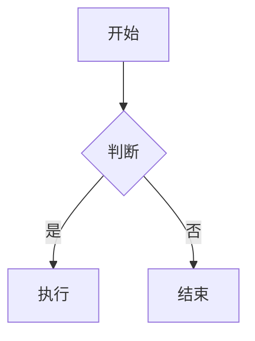

# 一级标题（H1）

## 二级标题（H2）

### 三级标题（H3）

#### 四级标题（H4）

##### 五级标题（H5）

###### 六级标题（H6）

---

## 段落与换行

这是第一段普通段落。Markdown 中相邻两行会被合并为同一段落。  
如果要在段落内换行，可以在行尾加上两个空格。  
或者使用 `<br>` 标签强制换行。

这是第二段，与上一段之间有空行。

---

## 强调与修饰

- *斜体（星号）*
- _斜体（下划线）_
- **加粗（双星号）**
- __加粗（双下划线）__
- ***加粗斜体（三星号）***
- ___加粗斜体（三下划线）___
- ~~删除线~~
- `行内代码`
- <u>下划线（HTML标签）</u>
- 上标示例：X<sup>2</sup>
- 下标示例：H<sub>2</sub>O
- ==高亮（部分扩展支持）==
- 表情符号：😊 🚀 ❤️

---

## 列表

### 无序列表

- 苹果
  - 红富士
    - 山东产
  - 嘎啦
- 香蕉
- 橙子

### 有序列表

1. 第一步
2. 第二步
   1. 子步骤 2.1
   2. 子步骤 2.2
3. 第三步

### 任务列表（GFM）

- [x] 已完成任务
- [ ] 未完成任务
- [ ] 待办事项子项
  - [x] 子项已完成

---

## 引用

> 这是一级引用。
>
> > 这是嵌套的二级引用。
> >
> > > 这是三级引用。
>
> 返回一级引用，可以包含 **加粗** 或 `代码`。

---

## 代码块

### 行内代码

使用 `console.log('Hello World')` 输出日志。

### 围栏代码块（带语言标识）

```javascript
function greet(name) {
  return `Hello, ${name}!`;
}

console.log(greet("Markdown"));
```

```python
def greet(name):
    return f"Hello, {name}!"

print(greet("Markdown"))
```

```bash
echo "测试 Shell 代码"
ls -la | grep .md
```

```json
{
  "测试": "JSON 高亮",
  "数值": 123,
  "布尔": true
}
```

### 纯文本代码块

```
这是一个没有指定语言的代码块。
    保留缩进。
支持多行。
```

---

## 表格（GFM）

| 左对齐 | 居中对齐 | 右对齐 |
| :----- | :------: | -----: |
| 苹果   | 红色     | ￥5.00 |
| 香蕉   | 黄色     | ￥3.50 |
| 橙子   | 橙色     | ￥4.20 |

带空单元格的表格：

| 姓名 | 年龄 | 城市 |
| ---- | ---- | ---- |
| 张三 | 28   |      |
| 李四 |      | 上海 |
|      | 35   | 北京 |

---

## 链接

- [普通链接](https://www.example.com)
- [带标题的链接](https://www.example.com "鼠标悬停提示")
- [相对路径链接](/docs/readme)
- [锚点链接](#表格gfm)
- 自动链接：<https://www.example.com>
- 邮箱链接：<test@example.com>

---

## 图片


带链接的图片（点击跳转）：

[](https://markdown-here.com)

---

## 分隔线

---

***

___

---

## 转义字符

\* 星号不被解析为强调  
\_ 下划线不被解析为强调  
\# 井号不被解析为标题  
\[ 方括号不被解析为链接  
\] 方括号  
\( 圆括号  
\) 圆括号  
\{ 花括号  
\} 花括号  
\` 反引号  
\\ 反斜杠  

---

## 脚注（扩展语法）

这是一个带脚注的句子[^1]。

另一个脚注示例[^note]。

[^1]: 这是脚注的具体内容，可以包含**加粗**和`代码`。
[^note]: 这是另一条脚注，支持多行描述。

---

## HTML 内联标签（部分渲染器支持）

<span style="color: red;">红色文字（style属性）</span>

<div style="background: #f0f0f0; padding: 8px;">
  这是一个 div 块，用于测试 HTML 块级元素是否被保留或过滤。
</div>

<kbd>Ctrl</kbd> + <kbd>C</kbd> 键盘按键。

---

## 定义列表（扩展语法，部分支持）

术语一
: 定义内容一

术语二
: 定义内容二
: 另一个定义

---

## 缩写（扩展语法，部分支持）

*[HTML]: 超文本标记语言
*[GFM]: GitHub Flavored Markdown

这里提到 HTML 和 GFM，如果渲染器支持缩写，会显示提示。

---

## 数学公式（部分扩展支持，如 KaTeX / MathJax）

行内公式：$E = mc^2$

块级公式：

$$
\sum_{i=1}^{n} i^2 = \frac{n(n+1)(2n+1)}{6}
$$

$$

\begin{aligned}
& \phi(x) = \frac{1}{\sqrt{2\pi}} \int_{-\infty}^{x} e^{-t^2/2} dt
\end{aligned}

$$

---

## 图表 / Mermaid（部分扩展支持）



---

## 混合嵌套测试

> 引用块内包含列表：
>
> - 列表项一
> - 列表项二
>
> 以及代码 `inline`。
>
> ```
> 引用内的代码块
> ```

- 列表内包含引用：
  > 这是列表项内的引用。
  > 可以多行。

- 列表内包含代码块：

  ```python
  print("列表内的代码块")
  ```

---

## 长文本与特殊字符

测试中文标点：，。；：“”‘’！？（）【】《》……—

测试特殊符号：© ® ™ ° ± × ÷ ≠ ≤ ≥ ≈ ∞ √ ∑ ∫ ∂

测试制表符和空格：  
前面有 4 个空格（代码块效果），但不在代码块内。

    这行前面有 4 个空格或一个制表符，部分渲染器会视为代码块。

---

## 结语

以上内容基本覆盖了 CommonMark 和 GFM 的常用语法，以及部分扩展语法（脚注、定义列表、数学公式、Mermaid 等）。请根据你的渲染器实际支持情况检验渲染效果。
